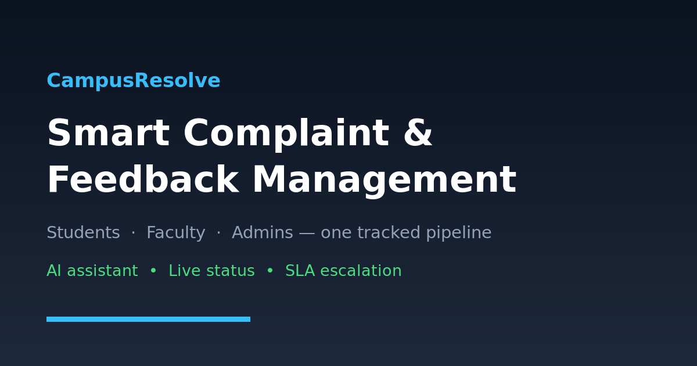
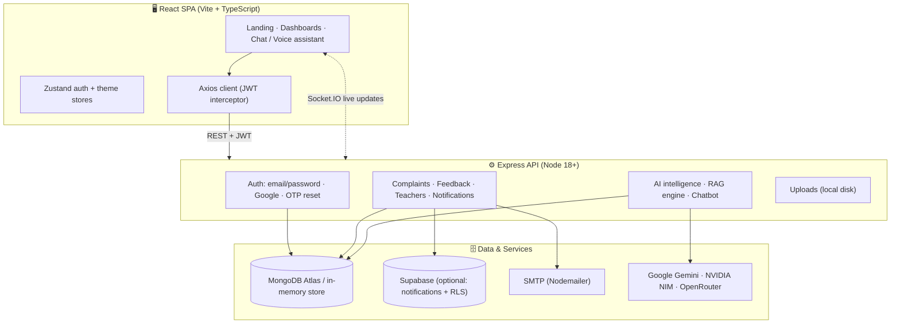

<div align="center">



# 🎓 CampusResolve

**Smart digital complaint & feedback management for campuses — with an AI assistant that actually resolves things.**

Students raise issues, faculty act on them, admins see everything, and an AI assistant answers status questions, drafts complaints and files feedback by voice or text.

[](https://nodejs.org)
[](https://react.dev)
[](https://www.typescriptlang.org)
[](https://expressjs.com)
[](https://www.mongodb.com/atlas)
[](https://vercel.com)
[](#-contributing)

[Live demo](https://mini-project-frontend-five.vercel.app) · [Architecture](docs/ARCHITECTURE.md) · [API reference](docs/API.md) · [Deployment](docs/DEPLOYMENT.md) · [Troubleshooting](docs/TROUBLESHOOTING.md)

</div>

---

## 📖 What is CampusResolve?

CampusResolve replaces the "email the office and hope" workflow with a tracked, accountable pipeline:

1. **A student files a complaint** — typed, or dictated to the AI assistant.
2. **The AI classifies it** — category, department, priority, duplicate detection, and a resolution-time prediction.
3. **It is routed to the right department** and its teacher, who updates the status through a documented lifecycle.
4. **The student watches progress** on a timeline, gets notified in-app + by email, and rates the resolution afterwards.
5. **Admins see the whole campus** — KPIs, department workload, SLA escalations, teacher performance and AI recommendations.

Everything works **with or without MongoDB**: if `MONGO_URI` is unreachable, the backend runs on an in-memory store with seed data so the UI is fully explorable offline.

---

## ✨ Features

<table>
<tr><th>👩‍🎓 Students</th><th>👨‍🏫 Faculty</th></tr>
<tr><td>

- File complaints with attachments
- AI-drafted & AI-enhanced descriptions
- Live status timeline per complaint
- Search, filter and track history
- Feedback + star rating after resolution
- Profile, QR digital ID, notifications

</td><td>

- Department-scoped complaint queue
- One-click status updates (with remarks)
- Activity log per teacher
- Performance analytics & ratings

</td></tr>
<tr><th>🛡️ Administrators</th><th>🤖 AI assistant</th></tr>
<tr><td>

- Campus-wide KPIs and charts
- Teacher & department management
- Assign / reassign / escalate by SLA
- Complaint & feedback analytics
- AI campus summary + recommendations

</td><td>

- Text **and** voice conversation
- RAG over live campus data
- Answers "where is my complaint?"
- Files complaints and feedback by voice
- Navigation by intent ("open my history")

</td></tr>
</table>

---

## 🏗️ Architecture



- **Two entry points, one route table.** `backend/src/server.js` (long-running Express, used locally and on Render/PM2) and `api/index.js` (Vercel serverless) both mount routes from `backend/src/routes/index.js`, so they can't drift apart.
- **Optional dependencies degrade gracefully.** No Supabase? Notifications skip the mirror. No MongoDB? The in-memory store takes over. Missing AI keys? The assistant falls back to rule-based replies.
- **Security by default.** Helmet, CORS, `express-mongo-sanitize`, rate limiting, bcrypt password hashes, JWT auth with a mandatory secret in production.

Deeper dive: **[docs/ARCHITECTURE.md](docs/ARCHITECTURE.md)**

---

## 🧰 Tech stack

| Layer | Technology |
| ----- | ---------- |
| **Frontend** | React 18, TypeScript 5, Vite 5, Tailwind CSS 3, Framer Motion, Zustand, TanStack Query, Recharts, Socket.IO client, react-router 6 |
| **Backend** | Node.js 18+, Express 4 (CommonJS), Mongoose 8, Socket.IO, JWT, bcryptjs, Nodemailer, Multer, Joi, Helmet, express-rate-limit, Winston-style logger |
| **AI** | Google Gemini (`@google/generative-ai`), NVIDIA NIM (OpenAI-compatible), OpenRouter fallback, in-house RAG engine + intent classifier, Web Speech API for voice |
| **Data** | MongoDB Atlas (primary), optional Supabase (notifications + Row Level Security), JSON in-memory store for offline/demo mode |
| **Auth** | Email/password (bcrypt + JWT), Google Identity Services + Supabase OAuth, OTP-based password reset, Google-scoped email allowlist |
| **Deploy** | Vercel (SPA + serverless API), any Node host for the Express server |

---

## 🚀 Quick start

### Prerequisites

- **Node.js 18+** and npm 9+
- *(optional)* MongoDB Atlas connection string — without it the app runs in offline demo mode
- *(optional)* A Google OAuth Client ID for Google sign-in

### 1. Clone and install

```bash
git clone https://github.com/Asfak0077/CampusResolve.git
cd CampusResolve
npm install          # installs the frontend + backend workspaces
```

### 2. Configure the backend

```bash
cp backend/.env.example backend/.env
```

Minimum to boot — the API starts even with everything else blank:

```dotenv
PORT=5001
MONGO_URI=mongodb+srv://<user>:<password>@<cluster>.mongodb.net/<db>
SECRET_KEY=<run: node -e "console.log(require('crypto').randomBytes(32).toString('hex'))">
FRONTEND_URL=http://localhost:5173
```

> 🔴 **Never commit `.env`.** This repository is public. If a connection string or API
> key has ever been committed anywhere, rotate it — see [SECURITY.md](SECURITY.md).

### 3. Configure the frontend

```bash
cp frontend/.env.example frontend/.env
```

```dotenv
VITE_API_BASE_URL=http://localhost:5001/api
VITE_GOOGLE_CLIENT_ID=your-client-id.apps.googleusercontent.com
```

### 4. Run both services

```bash
npm run dev            # backend on :5001 + frontend on :5173
# or individually
npm run dev:backend
npm run dev:frontend
```

Open **http://localhost:5173** and sign in with a demo account below.

---

## 🔑 Demo accounts

Seeded automatically in development (`SEED_DEMO_DATA=true`), never in production unless you opt in.

| Role | Username | Password | Notes |
| ---- | -------- | -------- | ----- |
| 👩‍🎓 Student | `student@campusresolve.edu` | `password123` | Comes with demo complaints `CR-001`, `CR-002` |
| 🛡️ Admin | `admin@campusresolve.edu` | `password123` | Override with `DEMO_ADMIN_PASSWORD` |
| 👨‍🏫 Teacher | `TCH-CSE-001` (or the teacher's email) | `teach123` | One per department: `TCH-ECE-001`, `TCH-MECH-001`, `TCH-EEE-001`, `TCH-AIDS-001`, `TCH-IT-001` |

Change these before letting anyone real use the deployment:

```bash
ADMIN_PASSWORD='S3cure!Pass' node backend/create_admin.js
TEACHER_DEFAULT_PASSWORD='Campus@2026' node backend/create_teachers.js
```

> In **offline mode** (no database) only `TCH-CSE-001 / teach123` is accepted for teachers.

---

## ⚙️ Environment variables

### Backend — `backend/.env`

| Variable | Required | Purpose |
| -------- | :------: | ------- |
| `PORT` | | API port (default `5001`) |
| `MONGO_URI` | | MongoDB Atlas connection string. Omit to run in offline/demo mode |
| `SECRET_KEY` | ✅* | JWT signing secret. *Required in production — the server refuses to sign tokens without it |
| `JWT_SECRET` | | Alias accepted for `SECRET_KEY` |
| `FRONTEND_URL` | | Origin used in emails and OAuth redirects (`http://localhost:5173`) |
| `GOOGLE_CLIENT_ID` | | Verifies Google ID tokens |
| `EMAIL_USER` / `EMAIL_PASS` | | SMTP credentials for complaint + password-reset mail. `EMAIL_FROM`/`EMAIL_ADMIN` override the sender |
| `GEMINI_API_KEY` | | Google Gemini — primary chatbot model |
| `NVIDIA_API_KEY` | | NVIDIA NIM (OpenAI-compatible) — RAG embeddings + generation |
| `OPENROUTER_API_KEY` | | Fallback LLM provider |
| `SUPABASE_URL` / `SUPABASE_SERVICE_ROLE_KEY` | | Optional notification mirroring + password recovery |
| `ALLOWED_EMAILS` | | Comma-separated Google-login allowlist |
| `SEED_DEMO_DATA` | | `true` forces demo seeding, `false` disables it (default: on outside production) |
| `DEMO_PASSWORD` / `DEMO_ADMIN_PASSWORD` / `TEACHER_DEFAULT_PASSWORD` | | Seed passwords |
| `MONGO_TLS_ALLOW_INVALID_CERTS` | | `true` only for dev proxies that break TLS validation |

### Frontend — `frontend/.env`

| Variable | Required | Purpose |
| -------- | :------: | ------- |
| `VITE_API_BASE_URL` | ✅ | API base, e.g. `http://localhost:5001/api` |
| `VITE_BACKEND_URL` | | Dev-server proxy target for `/api`, `/socket.io`, `/uploads` |
| `VITE_GOOGLE_CLIENT_ID` | | Google Identity Services client ID |
| `VITE_SUPABASE_URL` / `VITE_SUPABASE_PUBLISHABLE_KEY` | | Enables Supabase-authenticated notifications |
| `VITE_ENABLE_GOOGLE_AUTH` | | Set `true` to show the Google button (defaults off) |

---

## 📜 Available scripts

From the repository root (npm workspaces):

| Command | What it does |
| ------- | ------------ |
| `npm run dev` | Backend + frontend together |
| `npm run dev:backend` | Express API with `node --watch` on `:5001` |
| `npm run dev:frontend` | Vite dev server on `:5173` |
| `npm run build:frontend` | Type-check (`tsc`) + production build to `frontend/dist` |
| `npm run lint` | Frontend ESLint **and** a backend syntax check (both must pass) |
| `npm run test:security` | 22-check authorization regression test — run it with the API up |
| `npm run vercel-build` | Build command used by Vercel |

Backend maintenance scripts (`node backend/<script>.js`, all read `MONGO_URI` from the environment):

| Script | Purpose |
| ------ | ------- |
| `check-env.js` | Diagnose missing/placeholder configuration |
| `create_admin.js` · `create_teachers.js` | Seed admin and department teachers |
| `update_admin_password.js` | Reset the admin password (`ADMIN_PASSWORD=...`) |
| `list_students.js` · `get_admin_id.js` | Inspect accounts |
| `test_all_endpoints.js` | Smoke-test a running API |
| `scripts/security-smoke-test.mjs` | Verify anonymous calls are rejected and role boundaries hold |
| `scripts/resetTeachersPwd.js` | Bulk-reset teacher passwords (needs `--yes`) |
| `scripts/clear_complaints_feedback.js` | Wipe complaints + feedback (needs `--yes`) |

---

## 🔌 API overview

Base URL: `http://localhost:5001/api` — full reference in **[docs/API.md](docs/API.md)**.

| Group | Prefix | Highlights |
| ----- | ------ | ---------- |
| Auth | `/api/auth` | `student-login`, `teacher-login`, `verify-google-user`, `verify-otp`, `set-password` |
| Complaints | `/api/complaints` | `create`, `student/:id`, `admin/all-complaints`, `:id/assign`, `:id/update-status`, `admin/analytics` |
| Feedback | `/api/feedback` | submit, by student, by teacher, by department |
| Teachers | `/api/teachers` | list, create, remove |
| Notifications | `/api/notifications` | list, `unread-count`, `mark-read/:id`, `mark-all-read` |
| Analytics | `/api/analytics/teachers/performance` | Teacher ratings & resolution times |
| AI | `/api/ai-intelligence` | `complaints/:id` analysis, `admin/campus-summary`, `admin/recommendations` |
| Assistant | `/api/chatbot` | `message`, `create-complaint`, `join-complaint`, `submit-feedback` |
| Uploads | `/api/upload` | `multiple` (files served from `/uploads/*`) |
| Health | `/api/health` | Liveness probe |

---

## 🗂️ Project structure

```
CampusResolve/
├── api/index.js               # Vercel serverless entry → shared route table
├── backend/
│   ├── src/
│   │   ├── config/            # db + env helpers
│   │   ├── middleware/        # protect (JWT), authorize(role)
│   │   ├── models/            # Student, Teacher, Complaint, Feedback, Notification…
│   │   ├── routes/            # index.js = single mount table + feature routers
│   │   ├── services/          # AI intelligence, email, RAG
│   │   ├── templates/emails/  # HTML transactional emails
│   │   └── utils/             # RAG engine, escalation worker, seeds, socket, stores
│   └── scripts/               # Operational + destructive (guarded) scripts
├── frontend/
│   └── src/
│       ├── components/        # landing, admin, student, chat, ds (design system)
│       ├── context/ contexts/ # AI agent + notification providers
│       ├── routes/            # page-level components (see below)
│       ├── services/          # apiClient + voice/chat/AI services
│       ├── store/             # Zustand stores
│       └── styles/            # Tailwind layers + page CSS
├── docs/                      # architecture, API, deployment, troubleshooting
└── .github/                   # CI, issue + PR templates
```

**Frontend routes:** `/` landing · `/login` · `/student`, `/student/history`, `/student/feedback`, `/student/profile` · `/teacher` · `/admin`, `/admin/analytics`, `/admin/feedback`, `/admin/teachers`, `/admin/recommendations` · `/profile/:userId` public profile · `/about` · password flows (`/forgot-password`, `/reset-password`, `/set-password`).

---

## 🤖 How the AI assistant works

```
user text/voice
   → speech recognition (Web Speech API)
   → intent classifier        (services/ai/intentClassifier.ts, voice/IntentRouter.ts)
   → RAG retrieval            (backend RAG engine over complaints, feedback, campus KB)
   → agent / workflow         (status lookup, complaint draft, feedback, navigation)
   → response generator       (screen text + shorter spoken variant)
   → text-to-speech
```

Design choices worth knowing:

- **Screen vs speech text.** Long answers are summarized before being spoken; only the first 1–3 sentences are read aloud unless the user asks for detail.
- **Confirmation gates.** Complaint creation and feedback submission always require explicit confirmation before writing to the database.
- **Graceful degradation.** With no AI keys configured the assistant answers from the rule-based knowledge base instead of failing.

---

## ☁️ Deployment

The repository ships a root `vercel.json` that builds the SPA and serves the API through a single serverless function.

```bash
npm i -g vercel
vercel            # preview
vercel --prod     # production
```

Set `MONGO_URI`, `SECRET_KEY`, `FRONTEND_URL`, `EMAIL_*` and `VITE_API_BASE_URL` in the Vercel dashboard, and **not** in the repo. Full checklist → **[docs/DEPLOYMENT.md](docs/DEPLOYMENT.md)**.

---

## 🩺 Troubleshooting

| Symptom | Fix |
| ------- | --- |
| `MongoDB connection attempt 1/3 failed` | Atlas → Network Access → allow your IP (or `0.0.0.0/0` for dev only) |
| `The given origin is not allowed` on Google sign-in | Add `http://localhost:5173` to Authorized JavaScript origins in Google Cloud Console |
| `SECRET_KEY is not set` warning | Generate one and add it to `backend/.env` |
| API replies but data resets on restart | `MONGO_URI` is missing — you're in offline/in-memory mode |
| `Supabase disabled` warning | Expected without Supabase keys; the API continues normally |

More in **[docs/TROUBLESHOOTING.md](docs/TROUBLESHOOTING.md)**.

---

## 🗺️ Roadmap

- [ ] Route-level code splitting to shrink the initial JS bundle
- [ ] Automated test suite (Jest + Supertest, React Testing Library) wired into CI
- [ ] Typed shared API contracts between frontend and backend
- [ ] Configurable SLA policies per category/department
- [ ] CSV/PDF exports for admin analytics
- [ ] Accessibility pass (keyboard navigation + screen-reader labels) and dark-mode contrast audit

---

## 🤝 Contributing

Contributions are welcome — see **[CONTRIBUTING.md](CONTRIBUTING.md)** for setup, branching and the PR checklist, and our **[Code of Conduct](CODE_OF_CONDUCT.md)**.

```bash
git checkout -b feat/your-feature
npm run lint && npm run build:frontend   # must pass before you open a PR
```

---

## 🔐 Security

- Report vulnerabilities privately following **[SECURITY.md](SECURITY.md)**.
- Secrets live in environment variables only. `.env` is git-ignored.
- If a credential was ever committed, **rotate it** — deleting the file does not remove it from Git history.

---

## 📄 License

No license has been granted for this project yet, so all rights are reserved by the author.
If you want to reuse, fork or build on CampusResolve, open an issue to discuss licensing.

---

<div align="center">

Built with care for campuses that are tired of lost complaints. ⭐ Star the repo if it helped you.

</div>
