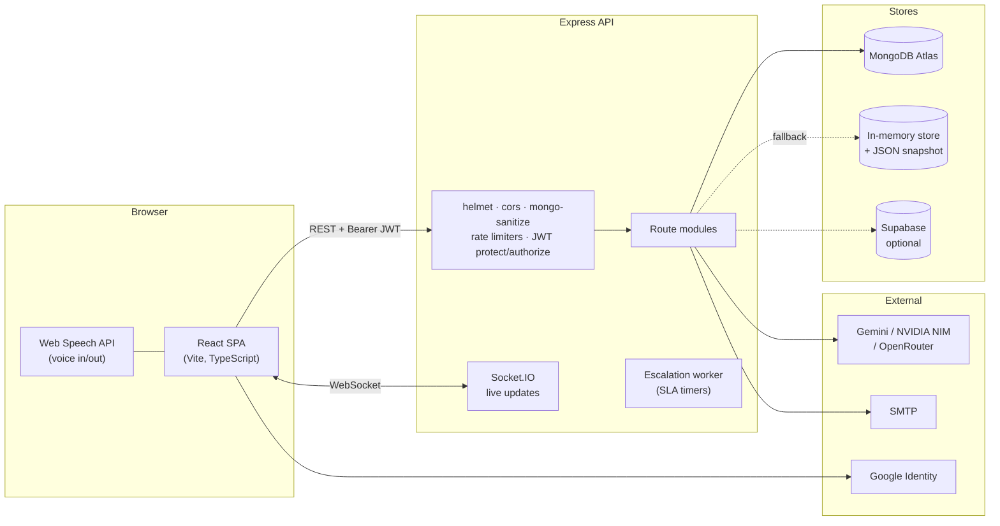
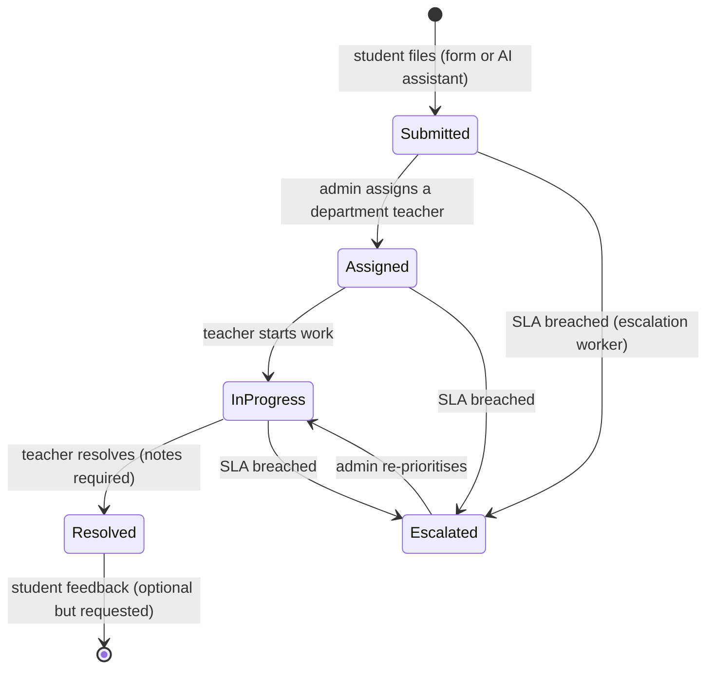

# Architecture

> How CampusResolve is put together, and why.

## 1. System overview



## 2. Runtime topology

| Context | Entry point | Notes |
| ------- | ----------- | ----- |
| Local dev / long-running host | `backend/src/server.js` | Express + Socket.IO + escalation worker; serves `/uploads` from disk |
| Vercel | `api/index.js` | Same Express app behind a serverless handler; no WebSocket server, uploads are ephemeral |

Both call **`backend/src/routes/index.js` → `mountRoutes(app)`**, the single mount table. This replaced duplicated mount lists that had already drifted apart (the serverless entry was missing the `/api/analytics/teachers` prefix, so teacher-performance analytics 404'd in production).

```js
// backend/src/routes/index.js
app.use('/api/auth', require('./authRoutesEnhanced'))
app.use('/api/users/profile', require('./profileRoutes'))
app.use('/api/users', require('./profileRoutes'))
app.use('/api/analytics/teachers', analyticsTeachers)
app.use('/api/analytics', analyticsTeachers)   // legacy alias
// …complaints, teachers, notifications, upload, feedback, chatbot, ai-intelligence
```

## 3. Request pipeline

```
request
 ├─ helmet                 security headers (CSP-friendly, cross-origin images allowed)
 ├─ cors                   permissive by default; tighten via FRONTEND_URL
 ├─ express-mongo-sanitize strips $ / . operators from user input
 ├─ express.json           1 MB body limit (5 MB on the serverless entry)
 ├─ morgan                 request logging
 ├─ rate limiters          auth (20 fails/15 min), AI (60/15 min), uploads (40/15 min)
 ├─ route handler
 │   ├─ protect           verifies the Bearer JWT → loads the user from DB or memory
 │   └─ authorize(roles)  role gate (student | teacher | admin)
 └─ error handler          JSON 500, details logged server-side only
```

**`protect` in detail** (`backend/src/middleware/authMiddleware.js`)

1. Reads `Authorization: Bearer <token>`.
2. Verifies with `getJwtSecret()` — **refuses to sign/verify with a default secret in production** (`backend/src/utils/jwtSecret.js`).
3. Accepts several claim names (`id`, `userId`, `sub`, `email`, `role`, …) so tokens from different providers keep working.
4. Resolves the account from MongoDB when connected, otherwise from the in-memory store.
5. Returns `401` when the account no longer exists — a deleted user cannot keep using an old token.

## 4. Data layer

### MongoDB (primary)

| Model | Collection | Purpose |
| ----- | ---------- | ------- |
| `Student` | `students` | Students **and** admins, distinguished by `role` |
| `Teacher` | `teachers` | Faculty accounts, department, workload counters |
| `Complaint` | `complaints` | The core record: category, department, priority, status, assignment, resolution |
| `Feedback` | `feedbacks` | Post-resolution ratings (5 dimensions + comments + tags) |
| `Notification` | `notifications` | In-app notification feed |
| `ActivityLog` | `activitylogs` | Audit trail of teacher/admin actions |
| `AllowedEmail` | `allowedemails` | Google sign-in allowlist |
| `EmailLog` | `emaillogs` | Outbound email audit |
| `ComplaintAIAnalysis` | — | Cached AI classification, priority, duplicate and SLA predictions |
| `Counter` | `counters` | Atomic sequence for human-readable complaint IDs (`CR-001`) |

### Offline / in-memory store

`backend/src/utils/inMemoryStore.js` is a full JSON-backed store used when `MONGO_URI` is absent or unreachable. It seeds students, teachers and demo complaints, persists to `backend/data/store.json` (git-ignored), and implements the same surface the routes need (`getComplaints`, `createComplaint`, `findTeacherByIdOrEmail`, notifications, feedback, AI analyses). Routes that need data branch on `mongoose.connection.readyState === 1`.

> Health check: the API logs `MONGO_URI is not configured. Running in offline/demo mode.` when it is *not* using a database — if your data resets on restart, that's why.

## 5. Complaint lifecycle



Every transition appends to the complaint timeline, writes an `ActivityLog` where relevant, creates notifications for the affected parties, fires transactional email, and pushes a Socket.IO event so open dashboards update without a refresh.

## 6. AI layer

```
frontend text/voice
  → intent classifier (services/ai/intentClassifier.ts)
  → agent orchestrator (services/voice/agentOrchestrator.ts)
      ├─ StatusAgent      "where is my complaint?"
      ├─ ComplaintAgent   multi-turn complaint drafting
      ├─ FeedbackAgent    post-resolution feedback flow
      ├─ NavigationAgent  "open my history"
      └─ SearchAgent      campus knowledge Q&A (RAG)
  → backend RAG engine (utils/ragEngine.js, services/aiIntelligenceService.js)
  → response generator → screen text + shorter spoken text → speech synthesis
```

Design rules:

- **Retrieval first, generation second.** The RAG engine answers from live complaint/feedback data and a curated campus knowledge base before falling back to an LLM, which keeps answers grounded.
- **Two-channel responses.** `screenText` can be long; `spokenText` is summarised (≤ 38 words) unless the user explicitly asks for detail.
- **Confirmation gates.** Writes (file complaint, submit feedback, join complaint) require explicit confirmation.
- **Graceful degradation.** No API keys → the rule-based knowledge base answers; no Web Speech API → text-only chat.
- **Guests are read-only.** Anonymous users may ask public questions; anything personal requires a JWT.

## 7. Frontend structure

| Area | Purpose |
| ---- | ------- |
| `components/landing` | Marketing page: hero, features, statistics, testimonials, footer |
| `components/ds` | Internal design system: `AppShell`, `AppSidebar`, `Cards`, `Table`, `Inputs`, `Charts` |
| `components/student` / `admin` / `teacher` | Feature UI per role |
| `components/chat` | Unified assistant, voice modal, message rendering |
| `services/voice` | Speech recognition, TTS, intent routing, agents, workflows |
| `services/ai` | Client-side intent classification, context management, RAG calls |
| `store` | Zustand: `authStore` (JWT + user), `themeStore`, `sidebarStore` |
| `context` / `contexts` | Global AI agent, Socket.IO, notifications |

**Routing** (`src/App.tsx`): public (`/`, `/about`, `/login`, password flows, `/profile/:userId`), student (`/student*`), teacher (`/teacher`), admin (`/admin*`), guarded by `components/auth/ProtectedRoute.tsx`.

**State & data:** Zustand for session/UI state, TanStack Query available for server state, one shared `apiClient` (axios) that injects the bearer token and redirects to `/login` on `401` except on auth endpoints.

## 8. Notifications & email

| Channel | Trigger |
| ------- | ------- |
| In-app (Socket.IO + store) | Complaint created, assigned, status changed, resolved, feedback requested |
| Email (`services/emailService.js` + `templates/emails/*.html`) | Complaint received, assignment, resolution, feedback reminder, password reset |
| Supabase (optional) | Mirrored notification rows for RLS-backed clients |

Emails are rendered from HTML templates and sent through SMTP (`EMAIL_USER` / `EMAIL_PASS`); every send is recorded in `EmailLog` so deliveries can be audited.

## 9. Background work

`utils/escalationWorker.js` runs on an interval in the long-running server, finds complaints past their SLA window, escalates them and notifies admins. On serverless it is skipped — a scheduled job (Vercel Cron / GitHub Action) is the recommended replacement, noted in the roadmap.

## 10. Known trade-offs

| Decision | Trade-off |
| -------- | --------- |
| Single Express app reused by both entry points | Fewer moving parts, but serverless mode loses WebSockets and disk persistence |
| In-memory fallback store | Great for demos and offline dev; not for production data |
| Roles on one `students` collection (`role: 'admin'`) | Simple auth flow, slightly odd naming |
| Local disk uploads | Zero-config locally; needs object storage (S3/R2) for durable multi-instance deployments |
| Large-ish frontend bundle | Vendor chunks are split, but route-level code splitting is still on the roadmap |
